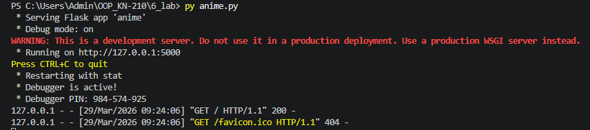
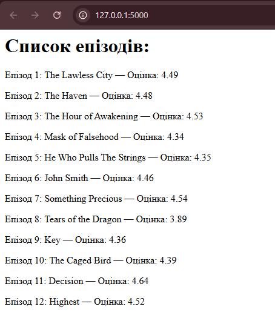

# Звіт до лабораторної роботи №6
**Тема:** Віртуальні середовища та робота зі сторонніми бібліотеками.
**Мета роботи:** Навчитися створювати ізольовані середовища, працювати з менеджерами пакетів (pip, pipenv, poetry) та використовувати сторонні API (Jikan, Flask).

## Виконання роботи

### Результати виконання завдань:
* **Створили** віртуальне середовище за допомогою `venv` та навчилися його активувати.
* **Встановили** необхідні бібліотеки: `Flask` для веб-сервера та `jikanpy-v4` для роботи з API аніме-бази.
* **Розробили** скрипт `anime.py`, який робить запит до API та виводить список епізодів у браузер.
* **Програма вивела** статус-код `200` при тестуванні бібліотеки `requests`, що підтверджує успішне з'єднання.
* **Отримано наступні результати:** Веб-сторінка успішно відображає назви та оцінки епізодів аніме.
* **Навчились** працювати з `pipenv` та `poetry` для професійного керування залежностями проєкту.

### Скріншоти виконання:

**1. Запуск локального сервера Flask у терміналі:**


**2. Результат відображення даних у браузері:**


### Код програми:
Ви можете переглянути повний код у файлі: [anime.py](./anime.py)

```python
@app.route('/')
def home():
    content = "<h1>Список епізодів:</h1>"
    for episode in j["data"]: 
        content += f"<p>Епізод {episode['mal_id']}: {episode['title']} — Оцінка: {episode['score']}</p>"
    return content

## Висновок:
Що зроблено: Налаштовано віртуальне середовище, встановлено залежності та створено веб-додаток на Flask.

Чи досягнуто мети: Так, мета повністю досягнута, навички роботи з ізольованими середовищами опановано.

Які нові знання отримано: Робота з API, маршрутизація у Flask та різниця між менеджерами пакетів.

Чи вдалось відповісти на всі питання: Так, усі етапи тестування (status_code, pip list) пройшли успішно.

Чи вдалося виконати всі завдання: Так, включно з запуском сервера та виводом даних.

Чи виникли складності: Були труднощі з налаштуванням шляху до Python у Windows (Aliases), але проблему вирішено через команду py.

Чи подобається такий формат: Так, створення реального веб-сервісу робить навчання цікавішим.

Побажання: Було б цікаво в наступних роботах додати стилізацію сторінок через CSS.